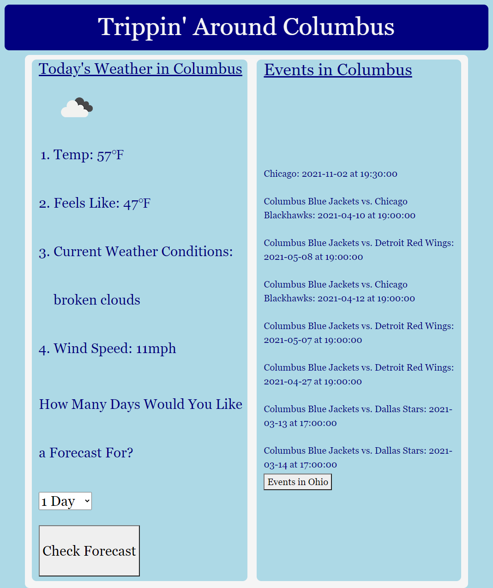

# Project 1: Trippin' Around Columbus, OH

Working collaboratively with other developers is an important step in the full-stack journey. This group project includes team members Rebecca Diroll, Tadhg McIntyre, and Edita Pesa. 

With the use of server-side APIs OpenWeather and Ticketmaster, Git branching workflow, and agile software development we have created an application for users to utilize while planning a trip to Columbus, OH. They will be able to view the weather and look through local events occurring in specifically Columbus or Ohio.

Here is the link to access the site: [Trippin' Around Columbus](https://tadhgmc.github.io/Project-1/)

